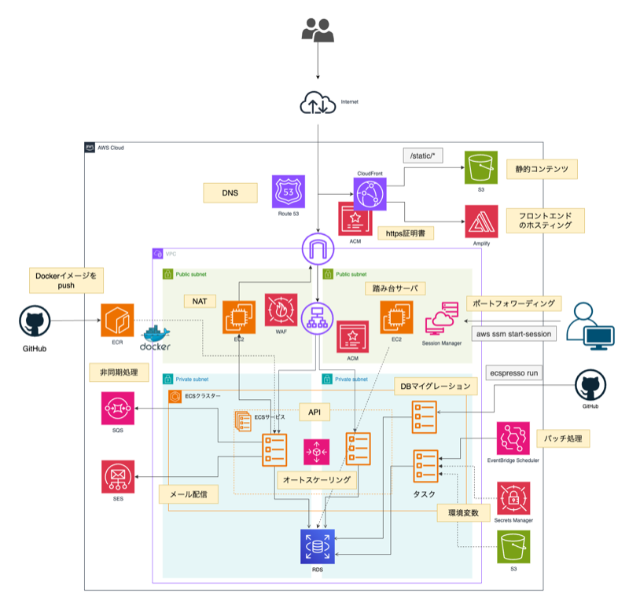
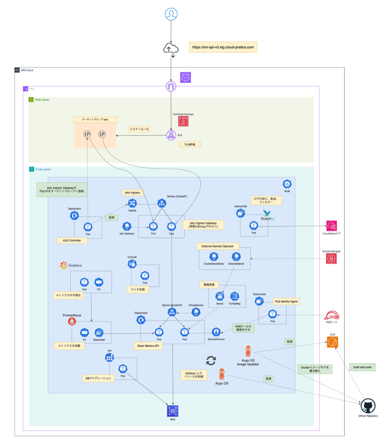
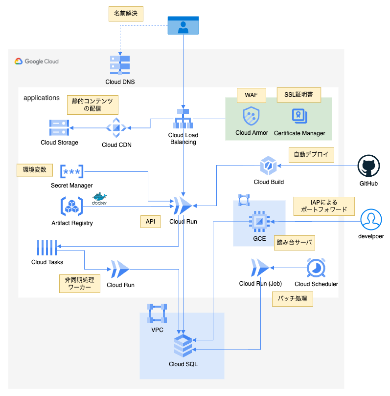

# 職務経歴書

## 基本情報

- **氏名**：久下　兼二朗（クゲ ケンジロウ）
- **生年月日**：1997/02/11
- **居住地**：東京都
- **最終学歴**：東京理科大学　応用数学科卒

## 職務要約

- Web 系バックエンドエンジニアとして約 6 年。人材・採用 SaaS のチームリーダー／グループマネージャー（4 〜 7 名規模、**約 2 年半**）を経て、現在はデジタルマーケティング領域における大規模な配信基盤の開発・運用に従事
- コアスキル: **AWS マネージドサービスの設計・運用（6 年、直近は ETL／ストリーム処理基盤の運用改善に注力）／ Go・TypeScript・PHP**
- 特に得意とするのは、EOS／EOL 対応や監査対応、パフォーマンス改善を通じて、既存基盤の信頼性とスケーラビリティを継続的に高めていくこと
- DDD・オブジェクト指向に関心が強く、変更容易性の高い設計と、他部署を巻き込んだスピード感のある開発推進を強みとする

## 各種アカウント

## 意欲・興味（今後挑戦したいこと）

- DDD・オブジェクト指向に基づく設計の知見をさらに深め、ドメインモデル中心の開発や設計レビュー文化の浸透をチームでリードしていきたい
- AWS・Google Cloud などのクラウド技術を活かし、IaC・CI/CD・オブザーバビリティを含めたプラットフォーム横断の設計・標準化を推進していきたい
- これまでのチームリーダー／マネージャー経験を活かし、10 名以上または複数チームを横断する開発組織で、エンジニアリングと組織づくりの両面をリードする立場に挑戦したい
- 新しい技術やツールの導入を、個人の取り組みから一歩進め、組織横断の技術選定や PoC を主導する立場で推進していきたい

## 自己 PR と、大切にしている仕事の進め方

### 自己 PR

1. 開発だけでなく他部署とも主体的に連携し、巻き込み型のスピード感のある開発を推進する
   - 企画との仕様整理・仕様ドキュメント整備を通じ、変更容易性の高い設計とドメイン知識の共有を重視。レビュー・QA の負担分散にも取り組んできた
   - グループマネージャー時は直属 4 〜 7 名の 1on1・半期評価と、クライアント約 100 社からの要望の集約・優先度付けを両立。現職では複数 AWS マネージドサービスの EOS／EOL を Biz と調整しつつ、商用への影響を抑えてリリース
2. 技術的課題には時間がかかっても根気強く責任を持ってやり遂げる
   - SAML SSO は Microsoft Entra ID（旧 Azure AD）前提から、フェデレーションメタデータ XML で他 IdP 連携へ拡張
   - Apache Flink のバージョンアップ（1.8 → 1.20）は未経験領域だったが、生成 AI を活用して学習を補い、監視・データ復旧まで含めて商用環境へリリースした

### 仕事をする上で大切にしている考え

- 心理的安全性と相互尊重を土台に、スピード感のある開発とオープンなコミュニケーションを両立する
- 「今やるべきこと」と「先に仕込むべきこと」の優先順位を見直しつつ、成長につながる経験にも積極的に投資する

## 言語・フレームワーク・DB/NoSQL・クラウド・SaaS/PaaS・その他ミドルウェアの開発経験

| 分類               | 技術（経験年数）                                                                                                                                                                                                                                                                                                                                                                                                                                                                                                                                                                                                                                                                                                                                                                                                                                                                                                                                                                                                                                                                                                                                                                                                                                                                                                                                                                                                                                                          |
| ------------------ | ------------------------------------------------------------------------------------------------------------------------------------------------------------------------------------------------------------------------------------------------------------------------------------------------------------------------------------------------------------------------------------------------------------------------------------------------------------------------------------------------------------------------------------------------------------------------------------------------------------------------------------------------------------------------------------------------------------------------------------------------------------------------------------------------------------------------------------------------------------------------------------------------------------------------------------------------------------------------------------------------------------------------------------------------------------------------------------------------------------------------------------------------------------------------------------------------------------------------------------------------------------------------------------------------------------------------------------------------------------------------------------------------------------------------------------------------------------------------- |
| 言語               |  7 年 /  5 年 /  5 年 /  2 年 /  11 ヶ月 /  11 ヶ月 /  8 ヶ月                                                                                                                                                                                                                                                                                                                                                                                                                                                                                                                                                                                                                                                         |
| フレームワーク     |  7 年 /  5 年 /  11 ヶ月 /  11 ヶ月 /  11 ヶ月                                                                                                                                                                                                                                                                                                                                                                                                                                                                                                                                                                                                                                                                                                                                                                                                                                                                                                               |
| DB・NoSQL          |  7 年 /  5 年 /  11 ヶ月                                                                                                                                                                                                                                                                                                                                                                                                                                                                                                                                                                                                                                                                                                                                                                                                                                                                                                                                                                                                                                                                                                                       |
| その他ミドルウェア |  4 年 /  5 年 /  5 年 /  1 年 /  11 ヶ月 /  11 ヶ月 /  11 ヶ月 /  11 ヶ月 /  11 ヶ月 /  11 ヶ月 /  10 ヶ月 /  10 ヶ月 |
| SaaS・PaaS         |  2 年 /  3 年 /  3 年 /  2 年 /  2 年 /  1 年                                                                                                                                                                                                                                                                                                                                                                                                                                                                                                                                                                                                              |

#### クラウド

| 技術                                                                                                  | 経験 | 利用リソース（目的別）                                                                                                                                                                                                                                                                                                                                                                                                                                                                                                                                              |
| ----------------------------------------------------------------------------------------------------- | ---- | ------------------------------------------------------------------------------------------------------------------------------------------------------------------------------------------------------------------------------------------------------------------------------------------------------------------------------------------------------------------------------------------------------------------------------------------------------------------------------------------------------------------------------------------------------------------- |
|  | 6 年 | **コンピューティング:** EC2・ECS・ECR・Lambda **データベース:** RDS（Aurora）・DynamoDB・ElastiCache **ストレージ:** S3 **ネットワーク:** VPC・CloudFront・Route 53・API Gateway（REST API） **セキュリティ:** Cognito・KMS・ACM・AWS WAF・SSM Parameter Store・Secrets Manager **CI/CD:** CodeBuild・CodeDeploy **データ分析・ストリーミング:** Athena・AWS Glue・Amazon OpenSearch Service・Managed Service for Apache Flink・Amazon EMR・Amazon Kinesis Data Streams・MWAA **監視・通知:** CloudWatch・SES・SNS・SQS・EventBridge Scheduler |

<h2 class="pdf-section-career">職務経歴詳細</h2>

<h3>職務経歴インデックス</h3>

雇用形態は全期間 **正社員**、職種は全期間 **バックエンド・インフラ**。

| 期間 | 会社名 | 業界 | プロジェクト | 役割 | 技術スタック |
| --- | --- | --- | --- | --- | --- |
| 2025/05 〜 現在 | Supership 株式会社 | デジタルマーケ | 統合型配信システム | メンバー | Go（Gin）、TypeScript（Next.js、NestJS） Terraform、AWS |
| 2025/07 〜 現在 | Supership 株式会社 | デジタルマーケ | マーケティングオートメーション基盤 | メンバー | Go（Echo）、TypeScript（Next.js） Terraform、AWS |
| 2020/04 〜 2025/04 | 株式会社ツナググループ・ホールディングス | 人材・採用 SaaS | 採用管理システム（ATS） | メンバー → TL → 開発 GM | PHP（Laravel）、JavaScript（jQuery） Python、Node.js、AWS |

### [Supership 株式会社](https://supership.jp/):正社員（2025/05 〜 現在）

#### デジタルマーケティング支援に関する統合型配信システム（2025/05 〜 現在）

【　事業内容: オフライン／オンライン行動データを活用した統合型の広告配信・1 to 1 コミュニケーション基盤。スクラム開発。配信ピーク QPS 1,000 〜 2,500。開発チーム: ディレクター 2 名・エンジニア 7 名ほど　】

##### 経験技術

| 区分 | 内容 |
| --- | --- |
| DB | Aurora PostgreSQL、DynamoDB、ElastiCache |
| インフラ | ECS、Lambda、Glue、MWAA、OpenSearch、Managed Service for Apache Flink、Kinesis、VPC、S3、SSM Parameter Store、Secrets Manager、CloudFront、Route 53、API Gateway（REST）、SES、SNS、SQS、EventBridge Scheduler 等 |
| 通信 | HTTP／HTTPS、REST |
| CI/CD | GitHub Actions、CodeBuild、CodeDeploy |
| 監視 | CloudWatch、Grafana、Prometheus、fluentd |
| タスク管理 | Notion |
| ドキュメント管理 | Notion |

#### 担当業務

- 広告配信に関わる機能の新規・保守開発を担当
- 主に配信ロジック・配信レポート・関連バッチ処理について、詳細設計・実装・テスト・リリース作業に従事

#### 主な課題解決事例

- **Amazon OpenSearch Service のマイナーアップグレード（1.2 → 1.3）**
  - **課題**: EOL 対応が必要だが、常時稼働の配信 API 向けクラスタで計画停止を取りづらかった
  - **対応 / 成果**: 専用マスター＋データノード構成を活かし Terraform からローリングアップグレード。検証環境で Vegeta 負荷や Glue 取り込みの影響を確認後、本番は低トラフィック帯に Grafana で監視しつつ実施し、**実質ダウンタイムゼロ**で EOL リスクを解消
- **Apache Superset のメジャーバージョンアップ（1.4.1 → 5.0.0）と ElastiCache の Valkey 移行**
  - **課題**: Superset と Redis v5 系キャッシュが陳腐化・EOL に近く、チャートの定期メール運用も継続する必要があった
  - **対応 / 成果**: Superset 5.0.0 へ追随すると同時に Valkey 7.2 へ切り替え。Docker・`superset_config`・Python 依存の 5.0 対応、レンダリングを Playwright 化、`pip`→`uv` などを実施。**約 1 人月**で脆弱性と延長課金リスクを解消し、既存メール運用を維持
- **Managed Service for Apache Flink のシステムバージョンアップ（1.8 → 1.20）**
  - **課題**: Scala 実装の大きな破壊的変更への追随が必要で、Flink・分散ストリーム処理は実務未経験だった
  - **対応 / 成果**: 生成 AI で知識を補いつつ段階的に 1.20 へ更新。監視設計とデータ復旧手順まで含め**約 2 ヶ月弱**で商用にリリース（参考: <a href="https://qiita.com/kugeke-ibex/items/7ca3608d235671786c45">Apache Flink バージョンアップで学んだあれこれ</a>）
- **AWS Glue ELT ジョブのパフォーマンス改善とコスト最適化**
  - **課題**: マーケティングオートメーション基盤連携の ELT が、締切内に終わらないケースがあった
  - **対応 / 成果**: Glue 3.0→4.0、`worker_type` を G.1X、ワーカー数を 2→6、`--enable-auto-scaling` を有効化するなど見直し、締切内完了を安定化。**平均 DPU 約 4.3 / 1 実行あたり約 18 円**のラインを確立
- **配信 API への新規広告タイプ追加に伴う負荷テスト**
  - **課題**: 純広告配信 API（想定上限 QPS 1,000）にネイティブ配信と優先度ロジックを足すため、性能根拠が必要だった
  - **対応 / 成果**: Vegeta で QPS 1,000 成功シナリオを設計し、レイテンシ分位・ECS リソースを計測。**最大 QPS 2,000** でも安定し、チューニングなしでリリース判断できる材料を得た
- **Amazon SNS からの HTTPS エンドポイント連携追加**
  - **課題**: 監視委託先の運用ルールに合わせ、HTTPS をプライマリ・メールをバックアップにする二系統化が必要だった
  - **対応 / 成果**: 重要な CloudWatch アラームに SNS の HTTPS サブスクを追加。認証情報・通知先は **SSM Parameter Store** に集約し、秘匿と保守性を改善
- **Amazon MWAA のメンテナンス後トラブル対応**
  - **課題**: メンテ後に `requirements.txt` の `pip install` が失敗し Scheduler / Worker が起動しなかった
  - **対応 / 成果**: 公式の **`--constraint`** で依存解決を安定化しコンテナを回復。以降も同種ビルド事故を抑える運用へ移行

#### マルチチャネルに対応した広告入稿に関するマーケティングオートメーション基盤（2025/07 〜 現在）

【　事業内容: セグメント・ターゲティング・A/B テストを扱うマーケティングオートメーション。メール・アプリ通知・SMS／RCS 等のマルチチャネル広告入稿。スクラム開発。開発チーム: ディレクター 3 名・バックエンド 8 名・フロントエンド 4 名規模　】

##### 経験技術

| 区分 | 内容 |
| --- | --- |
| DB | Aurora PostgreSQL、DynamoDB、ElastiCache |
| インフラ | ECS、Lambda、Glue、MWAA、Athena、SSM、Secrets Manager、SES、SNS、SQS 等 |
| 通信 | HTTP／HTTPS、REST |
| CI/CD | GitHub Actions |
| 監視 | CloudWatch、fluentd |
| タスク管理 | Notion、GitHub Projects |
| ドキュメント管理 | Notion |

#### 担当業務

- 複数チャネルの広告入稿・配信に関わる機能の新規・保守開発を担当
- 主にターゲティング・セグメント設定、配信ジョブのスケジューリング、各チャネル連携 API、関連バッチ処理について、詳細設計・実装・テスト・リリース作業に従事

#### 主な課題解決事例

- **API 認可の Casbin 化とポリシーの DB 管理（Ent + Atlas）**
  - **課題**: 認可ルールがコード・ファイルに散在し、環境差分の整理やレビュー・スキーマの再現性が取りづらかった
  - **対応 / 成果**: Cerbos / OPA 等と比較し **Casbin** を採用。Go API に組み込み、`ent-adapter` で Aurora PostgreSQL にポリシーを永続化し Atlas でマイグレーション。deny 優先のフラット型 RBAC と **`model.conf` 差し替えによる拡張**を両立し、変更を DB とマイグレーションに閉じた運用へ切り替え（現状: ロール 8 種・リソース約 26 ドメイン・ポリシー 9 行ほど）
- **Amazon MWAA ワーカーの高負荷対応**
  - **課題**: MWAA ワーカーのメモリ使用率は **約 90%** 付近まで上昇し続け、DAG に遅延リスクがあった
  - **対応 / 成果**: `mw1.small` → `mw1.medium` でコンピューティングを拡張し、`celery.worker_autoscale`（例: `"5,0"`）で同時実行を調整。メモリを **約 90% → 約 45%** に抑え遅延リスクを解消。月額は約 $364→約 $550 と増えたが、安定運用を優先
- **内部監査での指摘事項への対応（Tenable + Terraform）**
  - **課題**: Tenable スキャンに基づく指摘が検証・商用それぞれで 10 件以上あり、早期是正が必要だった
  - **対応 / 成果**: ログ証跡（CloudTrail の S3 記録）、SSE-KMS 暗号化、VPC Flow Logs、デフォルト SG のルール削除などに整理し **Terraform で IaC 管理下のリソースへ適用**。是正内容を再現可能な形で反映

### [株式会社ツナググループ・ホールディングス](https://tghd.co.jp/):正社員（2020/04 〜 2025/04）

#### 採用管理システム（ATS）開発プロジェクト

【　事業内容: 求人・応募・選考の一元管理、外部 API 連携による面接管理、顧客向けカスタマイズ。人材・採用業界向け SaaS。アジャイル・チケット駆動。クライアント約 100 社弱。開発チーム: PM 1 名・バックエンド 4 〜 7 名　】

**役割の変遷**　2020/04〜2022/12 メンバー、2023/01〜2023/09 チームリーダー、2023/10〜2025/04 開発グループマネージャー。

##### 経験技術

| 区分 | 内容 |
| --- | --- |
| DB | Amazon Aurora MySQL |
| インフラ | EC2、VPC、Lambda、S3、WAF 等、WafCharm。ブラウザ自動操作: Selenium、ChromeDriver、Playwright |
| 通信 | HTTP／HTTPS、REST、SAML（Microsoft Entra ID 等） |
| CI/CD | 社内リリースフロー（Backlog 連携） |
| 監視 | CloudWatch 等 |
| タスク管理 | Backlog |
| ドキュメント管理 | Backlog（Wiki）、Microsoft Teams、Slack |

#### 担当業務

- 選考フローに関わる機能の新規・保守開発を担当。主に詳細設計・実装・テスト・リリース作業に従事
- リーダークラス以降はプロジェクトの要件定義・設計・実装をリード
- クライアント要望に応じたカスタマイズ機能の提案・実装を担当

#### 主な課題解決事例

- **ブラウザ自動操作基盤のサーバーレス化とランタイム移行（Selenium・Lambda・Playwright）**
  - **課題**: EC2 上の Selenium + ChromeDriver 運用はサーバー保守の負荷が高く、Lambda 化後もランタイムライフサイクルへの追従が続いた
  - **対応 / 成果**: サーバーレスでブラウザ自動操作する構成へ移行。Lambda のランタイム要件に合わせ **Python から Node.js + Playwright** へ載せ替え、**割り当てメモリを約 1 割削減**してコストと保守性を両立
- **SAML 認証によるシングルサインオン（Microsoft Entra ID とフェデレーションの拡張）**
  - **課題**: 採用担当向けのログイン体験を SSO で改善する一方、特定 IdP 固定だけでは顧客ごとの IdP 要件に追従しづらかった
  - **対応 / 成果**: Microsoft Entra ID（旧 Azure AD）を前提に SAML SSO を導入。**フェデレーションメタデータ XML** を活用し、他 IdP との連携にも展開可能な実装に整理
- **AWS WAF の導入・運用整備から WafCharm への移行**
  - **課題**: アプリケーション層の防御を強化する必要があり、ルール運用を手作業に頼るだけでは再現性と工数の面で限界があった
  - **対応 / 成果**: WAF 導入と運用手順のドキュメント化後、ルール運用を **WafCharm** へ移し自動化。ルールを継続的に効かせつつ運用負荷を下げる流れを構築
- **求人応募メール取り込み不具合に伴うデータ復旧**
  - **課題**: 一定期間、応募メールをシステムへ取り込めない不具合があり、欠損データの補完が必要だった
  - **対応 / 成果**: 対象期間のメール情報を抽出・復旧する作業を主担当で実施し、事業への影響を抑止

#### 管理職としての業務内容

直属メンバー 4 〜 7 名を対象に、次を担当。

- 隔週の 1on1 を通じてチーム目標・個人目標の設定、進捗確認、達成に向けたサポートを実施
- チーム全体のタスク・工数・進捗を把握し、リソース配分と人員配置を調整
- 半期ごとの人事評価（年 2 回）とフィードバックに基づくスキル・キャリア面のアドバイスを実施
- PdM と連携した要件定義の調整、クライアント約 100 社からの追加要望の集約・優先度付けと実現可能なプランの策定
- 開発スケジュールの策定・進捗管理、課題の早期発見と解消によるプロジェクト完遂の支援
- メンバーの技術的な行き詰まりへの指導・解決策の提示、新技術・ツール導入の推進によるチーム全体の技術力向上
- チーム内外・他部署・ステークホルダーとのコミュニケーション調整、モチベーションと士気の維持

## 学習履歴

現役 SRE のメンタリングを受けながら、プライベートでもインフラを継続学習している。**AWS・Terraform** は実務の延長として設計を深め、**EKS・Google Cloud** についても本番に近い前提でハンズオン構成を組み立てた（以下、代表例）。

### AWS（ECS on Fargate を中心とした Web 基盤）

- **配信・DNS**: エッジは CloudFront。静的は S3、SPA は Amplify など（**OAC** により、閲覧者がバケット URL に直アクセスしない構成）。ドメインと証明書は Route 53・ACM
- **コンテナ**: ECS on Fargate。**API サービス**（常時稼働）、**デプロイ時に一度だけ走らせる DB マイグレ用タスク**、**EventBridge Scheduler から ECS `RunTask` で起動する定期バッチ**を分離
- **非同期・通知**: SQS（DLQ 付き）、SES
- **セキュリティ**: ALB 手前に WAF。秘密情報は **Secrets Manager** に置き、タスク定義の `secrets` から注入。運用ログインは **SSM Session Manager** 中心とし、SSH（22/tcp）の常時開放や長期鍵運用を避ける
- **CI/CD**: GitHub Actions でビルド → ECR（**イメージタグ IMMUTABLE**）→ **ecspresso** で ECS へ反映
- **補足**: 検証環境ではコスト学習の兼ね合いで、NAT Gateway の代わりに NAT インスタンスを利用

### Kubernetes（EKS + Istio + GitOps）

- **入口（インターネット → クラスタ）**: **利用者向け TLS** は **ACM** の証明書で **ALB** で終端。**AWS Load Balancer Controller** の **IP モード**で Istio Ingress Gateway（Pod）をターゲットにし、**Gateway** と **VirtualService** でバックエンドへルーティング
- **シークレット・AWS 連携**: **External Secrets Operator** が Secrets Manager と同期し、Kubernetes Secret を供給。**EKS Pod Identity** で **IAM ロールを Pod に紐づけ**、**IRSA** と同様に **長期アクセスキーを配布せず** AWS API を呼べるようにした
- **監視**: **Prometheus**／**Grafana**（クラスタ内で運用）。コンテナログは Fluent Bit 経由で **CloudWatch Logs** に送る
- **GitOps**: マニフェストは **Kustomize** と **Helm** で管理。GitHub Actions が ECR にイメージを push したあと、**Argo CD Image Updater** がレジストリ上の新イメージを検知し、**Git 側のイメージ参照**（Helm の values、Kustomize のイメージ指定など）を更新 → **Argo CD** がクラスタへ同期

### Google Cloud（Cloud Run を中心としたサーバレス基盤）

- **配信**: **Cloud Load Balancing（外部 HTTPS LB）** と **Google マネージド SSL 証明書**で外向け TLS を終端。静的は **Cloud Storage** をバックエンドにした **Cloud CDN**（LB の機能としてキャッシュ）、動的リクエストは **Cloud Run** へオリジン振り分け
- **セキュリティ**: **Cloud Armor**（WAF・レート制限）、**Secret Manager**。**Cloud SQL への運用接続**は、**外部 IP を持たない踏み台 GCE** と **IAP（Identity-Aware Proxy）の TCP forwarding** 経由に限定。ファイアウォールも **IAP 経路（`35.235.240.0/20`）からの 22/tcp** だけを許可し、常時開放や長期 SSH 鍵運用を避けた
- **ワークロード**: **Cloud Run サービス**（HTTPS API、**Cloud Tasks** の HTTP ターゲットとして呼び出すワーカー）、**Cloud Run Jobs**（**Cloud Scheduler** で定時実行するバッチ）
- **CI/CD**: **Cloud Build** が GitHub と連携し、`cloudbuild.yaml` のステージで **Artifact Registry** へビルド → 同じパイプラインから **`gcloud run deploy`** で **Cloud Run** へデプロイまでつなげた
